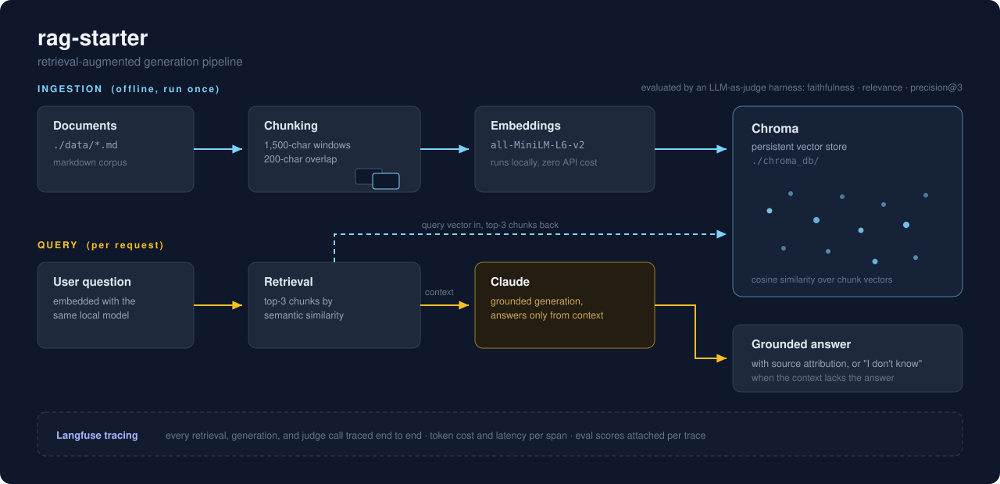
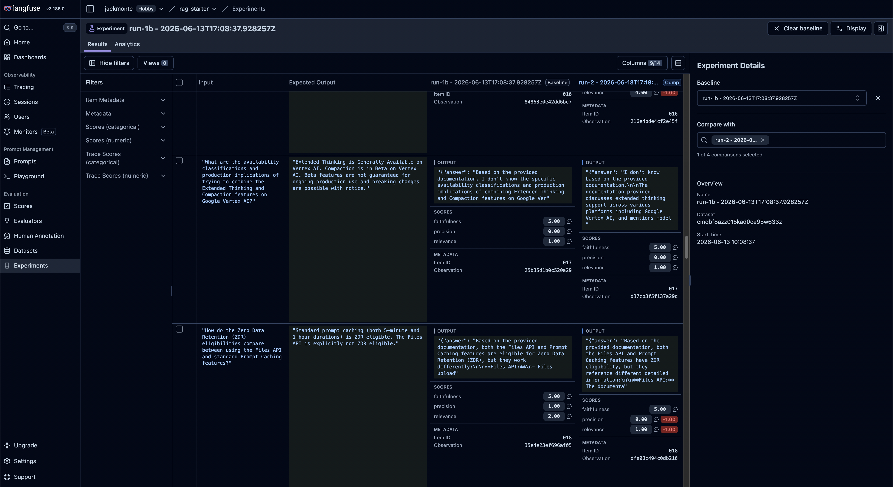

# rag-starter: RAG Pipeline for Semantic Search and Grounded Generation

A production-ready RAG (Retrieval-Augmented Generation) pipeline that ingests documents, embeds them into a vector database, retrieves semantically relevant chunks for a user query, and generates grounded answers using Claude. Built with Chroma, Anthropic, and Python.



---

## What it does

- Ingests markdown or text documents from a local directory
- Chunks documents with configurable chunk size and overlap
- Embeds chunks using Chroma's default embedding function (all-MiniLM-L6-v2, runs locally)
- Stores embeddings in a persistent Chroma vector database
- Retrieves top-K semantically similar chunks for any user query
- Generates Claude-grounded answers using only retrieved context
- Returns both the answer and source attribution (which documents were used)
- Prevents hallucination by constraining Claude to say "I don't know" when context is insufficient
- Processes many queries concurrently via an async batch dispatcher (bounded by a semaphore), for high-throughput workloads

---

## How it works

A user query flows through four stages:

**Document ingestion and chunking:** Raw markdown files are loaded from `./data/`, split into fixed-size chunks (default: 1,500 characters with 200-character overlap, sliding-window), and prepared for embedding. Chunking strategy balances retrieval granularity (smaller chunks = more precise results) against context preservation (larger chunks = more surrounding context per result).

**Embedding and storage:** Each chunk is embedded using Chroma's default embedding function (all-MiniLM-L6-v2, run as an ONNX model on onnxruntime, locally, zero API cost). Embeddings are stored in a persistent Chroma collection at `./chroma_db/` alongside metadata (source file, chunk index). The persistent collection survives between runs and can be queried without re-ingesting.

**Retrieval:** When a user asks a question, the question is embedded using the same model and used as a query vector against the stored embeddings. Chroma returns the top-K most similar chunks (default: 3) ranked by cosine similarity. This semantic search retrieves relevant context even if keywords don't match exactly.

**Grounded generation:** Retrieved chunks are formatted with source attribution and passed to Claude as context. A system prompt explicitly instructs Claude to answer only from the provided context. Claude generates an answer grounded in the retrieved chunks and cites which chunks support the answer. If the context doesn't contain the answer, Claude says "I don't know based on the provided context" rather than hallucinating.

---

## Architecture: RAG vs long-context

This implementation uses chunked retrieval (RAG): splitting the corpus into pieces, embedding each, and selectively retrieving only the relevant chunks for each query.

**Why RAG for rag-starter?**
- Works with corpora larger than a single LLM context window
- Reduces per-query latency (retrieve 3 chunks, not 100K tokens)
- Reduces per-query cost (pay for retrieved context only, not the entire corpus)
- Scales gracefully as the corpus grows

**When long-context beats RAG:**
As of 2026, Anthropic's current models (Opus 4.8, Opus 4.7, Opus 4.6, and Sonnet 4.6) support a 1M-token context window at standard pricing. For corpora that fit entirely in context (most documents under ~800K tokens), a single long-context call is often simpler and sometimes cheaper than chunking + retrieval.

If you're building a similar system for a different corpus, benchmark both approaches:
- Time and cost to ingest and maintain RAG pipeline
- Per-query latency and cost for RAG retrieval + generation
- Per-query cost for long-context call with full corpus

For production, measure against your actual usage patterns before committing to either.

---

## Limitations

- Embedding quality depends on the corpus. Retrieval is only as good as the embeddings. For domain-specific jargon (medical, legal, technical), consider fine-tuned or domain-specific embedding models in production.
- Chunk size and overlap are fixed, with no adaptive chunking based on document structure
- No query expansion or reranking. Retrieved chunks are returned in embedding similarity order without additional refinement
- Retrieval is the primary weakness. Precision@3 scores 0.20 on edge cases and 0.00 on adversarial queries. Generation stays grounded when the right chunks are found, but the pipeline does not reliably retrieve them for ambiguous or adversarial inputs. Retrieval quality is the primary area targeted for improvement. See the eval results below for the full baseline.
- Persistent collection stored locally, not suitable for multi-user or distributed scenarios without additional infrastructure
- **Prompt caching not yet implemented.** Anthropic prompt caching will be
  applied in a later hardening pass once a token-cost baseline is established.


---

## Eval results (current baseline)

Automated eval harness using LLM-as-judge scoring (Claude Haiku, temperature=0). 40 test cases across four categories. Full dataset: `evals/dataset.json`.

**These numbers are corpus-dependent.** The baseline was measured against the demonstration corpus in `data/`, and the 40 golden Q/A pairs in `evals/dataset.json` are keyed to it: the questions assume its content and the precision@3 judgments assume its chunk boundaries. Because that corpus ships with the repository, the baseline reproduces on a fresh clone. Swap in a different corpus and the harness still runs, but the scores measure how well your documents answer questions written for someone else's. To evaluate your own pipeline, replace `evals/dataset.json` with pairs written against your corpus and re-baseline. The methodology, the three metrics, the judge prompts, and the per-item error isolation all carry over unchanged.

The three judges use Anthropic [structured outputs](https://docs.claude.com/en/docs/build-with-claude/structured-outputs) (constrained decoding via `messages.parse`), so the judge is guaranteed to return schema-valid JSON rather than free-text that has to be parsed. This replaced an earlier free-text-and-parse approach that intermittently failed when the judge prefaced its JSON with prose. See the note under Results.

### Metrics

- **Faithfulness (1–5):** Does the answer accurately reflect the retrieved chunks? Penalizes hallucination.
- **Relevance (1–5):** Does the answer address the question? Penalizes responses where chunks were retrieved but didn't produce a useful answer.
- **Precision@3 (0 or 1):** Do the top-3 retrieved chunks contain sufficient information to answer the question?

### Results

| Category | Avg Faithfulness | Avg Relevance | Precision@3 | Count |
|---|---|---|---|---|
| happy_path | 5.00 | 3.75 | 0.62 | 16 |
| edge_case | 4.90 | 2.50 | 0.20 | 10 |
| adversarial | 5.00 | 5.00 | 0.00 | 4 |
| bias_paired | 4.90 | 3.30 | 0.60 | 10 |
| **OVERALL** | **4.95** | **3.45** | **0.45** | **40** |

n = 40, 0 errored items.

**On the instrument change.** These numbers are consistent with an earlier free-text-judge read (4.95 / 3.55 / 0.53): faithfulness is identical and the small relevance and precision differences are ordinary run-to-run variation. The value of the structured-outputs migration is reliability, not a score change: the previous free-text judge intermittently returned prose instead of JSON (13 of 40 items failed to parse on one run), and constrained decoding eliminated that failure class entirely. This run is the canonical baseline going forward. A scorer wiring bug found and fixed during re-baselining accounts for the earlier discrepancy.

### Interpretation

The earlier read showed the same pattern: the weakness is retrieval, not generation. Precision@3 drops to 0.20 on edge cases and 0.00 on adversarial queries, and the lower relevance and faithfulness in those categories follow directly from it. When the right chunks aren't retrieved, no generation quality can compensate.

The adversarial category (precision@3=0.00, relevance=5.00) shows the grounding constraint working as intended: the four adversarial cases scored perfectly on relevance because the system correctly returned "I don't know based on the provided documentation" rather than inventing an answer when no chunks were retrieved.

The gap to close remains retrieval quality, not generation quality.

### Bias check

5 paired test cases (`bias_paired` category) phrase the same factual question with different demographic or organizational framing (e.g. US vs. EU context, personal hobby vs. commercial production). Scores were consistent across the paired cases, with minor relevance variation on 2 of 5 pairs that tracks to corpus coverage (EU regulatory and production-deployment content is underrepresented relative to US and hobby-project content) rather than model bias.

---

## Observability

Every query and every eval run is traced end to end with [Langfuse](https://langfuse.com/). Instrumentation uses the Langfuse Python SDK (v4) context-manager pattern, so latency is timed automatically per span and cost is computed from the model name plus token usage passed on each generation.

### What gets traced

Each eval item produces a single trace named `eval_item`, with everything nested underneath it:

    eval_item                     (per-item root span: question in, scores out)
    ├── main_rag_query            (the RAG query)
    │   ├── retrieval             (Chroma similarity search)
    │   └── generation            (Claude grounded answer, token usage + cost)
    ├── scorer_faithfulness       (LLM-as-judge)
    ├── scorer_relevance          (LLM-as-judge)
    └── scorer_precision          (LLM-as-judge)

The three eval metrics are emitted as Langfuse score objects attached to the item's trace, not just logged as span output, so they populate the Scores panel and Scores Analytics. Each metric is backed by a Score Config (faithfulness and relevance NUMERIC 1-5, precision NUMERIC 0-1) for range validation and distribution charts. All items from one eval run share a `session_id` and an `eval` tag, so a run appears as a single Session containing many traces.

In production (serving a real user query) only `main_rag_query` runs, with no scorer spans, so live traffic stays a clean one-trace-per-query. The scorer spans appear only during eval runs.

### What the dashboard shows

A full 40-item eval run looped to 120 items produced 120 `eval_item` traces, 840 observations, 360 score objects (120 each of faithfulness, relevance, precision), and total cost tracked per model ($0.22 for the run).


Latency is captured per span at p50/p90/p95/p99, broken out by trace, generation, and observation. The observation table makes the nested structure visible: the `eval_item` trace spans the full per-item duration (p50 7.7s) while the individual `main_rag_query`, `generation`, and scorer spans each report their own latency.


### Why Langfuse

Langfuse is open source and self-hostable, with a free Cloud tier that covers a project at this scale at no cost. Tracing, score emission, and dashboards all work the same whether running against Langfuse Cloud or a self-hosted instance, so the same instrumentation carries forward to later projects without rework.

### Eval experiments

The eval dataset is also mirrored into a Langfuse Dataset (`rag-starter-eval`), and `evals/experiment.py` runs the same RAG pipeline and the same three judges through Langfuse's experiment runner. Each run links every generation to its dataset item and attaches the three scores, so two runs can be compared item by item in the Experiments UI, with per-metric deltas highlighted.

    python -m evals.experiment --name run-1

This path is additive and does not replace the canonical local harness. `runner.py` remains the source of truth for the baseline (it regenerates `results.json` and `summary.json` on every run, which are gitignored; the authoritative scores are recorded in PR bodies and in the eval table above). The managed experiment path is for run-over-run comparison in the UI and to seed the methodology that scales to later projects. The seed step is a one-time `python -m scripts.seed_langfuse_dataset`.



---

## Quick start

**Clone and enter the project:**

    git clone https://github.com/digitalrower/rag-starter.git
    cd rag-starter

**Pin Python version (requires pyenv):**

    pyenv local 3.13.3
    python --version              # should show Python 3.13.3

**Create and activate a virtual environment:**

    python -m venv .venv
    source .venv/bin/activate     # Mac/Linux
    # Windows: .venv\Scripts\activate

**Install dependencies:**

    pip install -r requirements.txt

**Set up environment variables:**

    cp .env.example .env

Open `.env` and replace the placeholder with your actual Anthropic API key:

    ANTHROPIC_API_KEY=your_actual_api_key_here

**Corpus:**

A demonstration corpus ships in `data/` so the pipeline runs immediately. See `data/NOTICE.md` for its provenance and licensing, and [Ingest documents](#ingest-documents) to swap in your own.

---

## Ingest documents

A demonstration corpus ships in `data/`, so ingest works on a fresh clone with no setup. Those files are third-party documentation under separate terms; see `data/NOTICE.md`.

To use your own corpus, replace the contents of `data/` with your own markdown. The loader reads `*.md` from the top level of the directory, treats each file as one source document, and uses the filename as the source attribution shown in query output. If the directory is empty, ingest completes with zero chunks and every query returns "I don't know based on the provided context." That is the grounding constraint working correctly, not a failure.

**Run the ingestion pipeline:**

    python -m rag_starter.ingest

This will:
1. Load all `.md` files from `./data/`
2. Chunk them (1,500 characters, 200-character overlap)
3. Embed and store in `./chroma_db/`
4. Print a summary of the total chunks added and the collection count

The collection is persistent. Run this once, then query as many times as you want without re-ingesting.

---

## Query the pipeline

**From the command line:**

    python -m rag_starter.query "What are agent skills?"

**Output:**

```
Answer: Based on the provided documentation, **Agent Skills** are modular
capabilities that extend Claude's functionality. Each Skill packages
instructions, metadata, and optional resources (scripts, templates) that
Claude uses automatically when relevant. [...]

Sources: ['agent-skills.md', 'managed-agents-overview.md']
```


**Test multiple queries:**

For testing grounding, try:
- A query answerable from your corpus (verify Claude cites sources)
- A query NOT in your corpus (verify Claude says "I don't know", no hallucination)
- An ambiguous query (verify Claude acknowledges ambiguity and uses context)

---

## Run with Docker

The pipeline runs in a container with the embedding model and a demo corpus baked into the image. Chroma persists to a named volume, and the Anthropic API key is injected at runtime, never baked into the image.

**Pull the published image** (skip the build if you just want to run it):

    docker pull digitalrower/rag-starter:latest

Then use `digitalrower/rag-starter:latest` in place of `rag-starter:latest` in the commands below, or build locally instead:

**Build the image:**

    docker build -t rag-starter:latest .

**Create the named volume** (persists the Chroma store across containers; one time):

    docker volume create rag_chroma

**Ingest first** (populates the volume; run once before querying):

    docker run --rm \
      -v rag_chroma:/app/chroma_db \
      --env-file .env \
      rag-starter:latest \
      python -m rag_starter.ingest

**Query** (the default command answers a demo question, reading the volume ingest wrote):

    docker run --rm \
      -v rag_chroma:/app/chroma_db \
      --env-file .env \
      rag-starter:latest

**Query your own question:**

    docker run --rm \
      -v rag_chroma:/app/chroma_db \
      --env-file .env \
      rag-starter:latest \
      python -m rag_starter.query "your question here"

Querying before ingest fails with `Collection [anthropic_docs] does not exist`. That is expected; run the ingest step first. A collection that exists but holds no chunks raises `RetrievalError` naming the empty collection, which is the same fix.

---

## Batch queries (async)

For high-throughput workloads, the pipeline can process many queries concurrently instead of one at a time. `query.main` is async, and `query.main_batch` dispatches a list of questions through `asyncio.gather`, bounded by a semaphore so concurrency is capped (protecting against API rate limits and trace-export flooding). Each query still flows through the same typed `Chunk`/`QueryResponse` boundaries and still emits its own independent Langfuse trace; only the dispatch changed, not the data contract. Failures are isolated by class. `main_batch` returns a `BatchResult` splitting successful `QueryResponse` objects from failed `(question, exception)` pairs, and a `RAGError` (a retrieval or generation failure on a single question) is counted there rather than stopping the run, so one bad query never sinks the batch. Anything else is treated as a bug rather than a bad question: the batch lets every task settle, then raises a `BaseExceptionGroup` carrying the unexpected exceptions. Raising discards the responses already produced, so a caller cannot recover partial results from the group; that tradeoff is deliberate, since a systematic failure should surface as a crash rather than an inflated failure count. Cancellation is never wrapped: cancelling the awaiting task propagates out of `gather` directly, and a cancelled child task is re-raised unchanged once the remaining tasks settle. `max_concurrency` must be at least 1, validated on both the CLI flag and the function argument, because `asyncio.Semaphore(0)` is legal and blocks forever rather than failing.

A sync wrapper (`query.main_sync`) preserves the one-query-at-a-time interface for callers that want it (the eval runner and experiment runner use it), so the async core does not force existing sync code to change.

**Benchmark.** `scripts/benchmark_batch.py` runs the same dataset questions sequentially and concurrently against the same async pipeline, so the only variable is concurrency:

    python -m scripts.benchmark_batch                      # default max_concurrency 5
    python -m scripts.benchmark_batch --max-concurrency 10

Measured on the 40-question eval dataset, through the full traced pipeline (retrieval + generation + Langfuse tracing intact):

| | Time | Per query |
|---|---|---|
| Sequential (`await` each in a loop) | 91.13s | ~2.28s |
| Parallel (`main_batch`, max_concurrency 5) | 17.15s | n/a |
| **Speedup** | **5.31x** | |

All 40 succeeded in both phases. The speedup is lower than a naive bare-API-call benchmark would show, and that is the honest number: concurrency is capped at 5 (not unbounded), retrieval is synchronous so only the generation step overlaps, and tracing overhead is paid on both sides. Raising `--max-concurrency` pushes the ratio higher at the cost of more simultaneous API and trace-export load.

A ratio is only printed when both phases completed the same number of successful queries. If a phase produced no successes, or the two phases succeeded on different subsets, the speedup line says so instead of showing a number, and the script exits nonzero. A ratio measured over queries that failed before reaching the API would look plausible and mean nothing, and it is the figure most likely to be quoted, so an automated caller can check the exit status rather than parsing output.

---

## Code quality

Type checking, linting, and tests run automatically in CI on every push via GitHub Actions.

- **mypy**: enforces type hints on all function signatures and return types. Config in `pyproject.toml` under `[tool.mypy]`. A failing mypy check blocks merge to `main`.
- **ruff**: lint and format checks. Config in `pyproject.toml` under `[tool.ruff]`. Enforces import order, line length, and common bug patterns. A failing ruff check blocks merge to `main`.
- **pytest**: unit tests covering the async batch dispatcher and the client lifecycle (see Tests below). A failing test blocks merge to `main`.

Development tooling (pytest, pytest-asyncio, mypy, ruff) is declared as an optional `dev` extra. Install it in editable mode:

    pip install -e ".[dev]"

To run the checks locally before pushing:

    ruff check src/ evals/ scripts/ tests/
    ruff format --check src/ evals/ scripts/ tests/
    mypy src/ evals/ scripts/
    pytest -v

To auto-fix ruff violations in place:

    ruff format src/ evals/ scripts/ tests/

### Tests

The suite targets the concurrency-sensitive parts of the pipeline, where correctness is least obvious from reading the code:

- **Async dispatcher contract:** `main_batch` returns one valid `QueryResponse` per input question, order preserved, with no dropped or duplicated results. The Anthropic client is mocked and retrieval runs against a small in-memory Chroma collection, so the test is fast and hits no network.
- **Client lifecycle:** the per-call `AsyncAnthropic` client is closed explicitly inside the event loop that owns it, rather than left to garbage collection after the loop closes. This guards against the connection-pool teardown that otherwise surfaces as `RuntimeError: Event loop is closed` on repeated runs.
- **Error boundary:** a `RAGError` is counted as a failed question and the batch continues; anything outside that hierarchy aborts the batch rather than inflating the failure count. The argument guards on `max_concurrency` and `n_results` are covered too, since both prevent failures that would otherwise be silent rather than loud.

Run them with `pytest -v`.

---

## Requirements

- Python 3.13+
- Git
- An Anthropic API key ([get one here](https://console.anthropic.com))

Runtime dependencies are listed in `requirements.txt`. See [Tech stack](#tech-stack) below. Development tooling (tests, type checking, linting) installs via the `dev` extra: `pip install -e ".[dev]"`.

---

## Project structure

    rag-starter/
    ├── .github/
    │   └── workflows/
    │       └── ci.yml            # mypy + ruff + pytest checks on every push
    ├── src/
    │   └── rag_starter/
    │       ├── __init__.py
    │       ├── client.py         # Sync + async Anthropic client factories (retries, timeouts)
    │       ├── errors.py         # Typed RAGError hierarchy
    │       ├── models.py         # Pydantic boundary models (Chunk, QueryResponse, ...) + BatchResult dataclass
    │       ├── ingest.py         # Load, chunk, embed, store
    │       └── query.py          # Async retrieve/generate + main_sync wrapper + main_batch dispatcher (Langfuse traced)
    ├── evals/
    │   ├── dataset.json          # 40 golden Q/A pairs (happy_path, edge_case, adversarial, bias_paired)
    │   ├── scorer.py             # LLM-as-judge scoring logic
    │   ├── runner.py             # Canonical eval run; per-item tracing + score emission, writes results/
    │   ├── experiment.py         # Additive Langfuse Datasets/Experiments runner (run-over-run compare)
    │   └── results/              # Per-run eval output (gitignored; regenerated by runner.py)
    │       ├── results.json      # Per-item eval output
    │       └── summary.json      # Per-category and overall averages
    ├── scripts/
    │   ├── seed_langfuse_dataset.py  # One-time seed of dataset.json into a Langfuse Dataset
    │   └── benchmark_batch.py        # Sequential vs async-batch benchmark (sequential/parallel timing)
    ├── assets/                   # README screenshots (Langfuse dashboard, latency)
    ├── tests/
    │   ├── __init__.py
    │   ├── conftest.py           # fixtures: in-memory Chroma collection, mocked async client
    │   └── test_query_batch.py   # async dispatcher contract + client-lifecycle tests
    ├── data/                     # Demonstration corpus (third-party; see data/NOTICE.md)
    ├── chroma_db/                # Persistent vector database (gitignored)
    ├── pyproject.toml            # mypy, ruff, pytest config + dev extra
    ├── .env.example              # Environment variable template
    ├── .gitignore
    ├── .python-version
    ├── requirements.txt
    └── README.md

---

## Ingest configuration

Edit these parameters in `src/rag_starter/ingest.py` to tune ingestion behavior:

| Parameter | Default | Impact |
|-----------|---------|--------|
| `chunk_size` | 1,500 characters | Larger = more context per chunk, fewer total chunks. Smaller = more granular retrieval, more chunks. |
| `overlap` | 200 characters | Overlap between adjacent chunks. Prevents context loss at chunk boundaries. |

---

## Retrieval configuration

Edit these parameters in `src/rag_starter/query.py` to tune retrieval behavior:

| Parameter | Default | Notes |
|-----------|---------|-------|
| `n_results` | 3 | Retrieved chunk count per query. Start at 3, increase if Claude needs more context. Must be 1 or greater. |
| `max_tokens` | 500 | Max response length. Increase if answers are truncated; decrease to reduce cost. |

---

## API reference

### Ingest

**Purpose:** Load documents, chunk, embed, and store in Chroma.

**Command:**

    python -m rag_starter.ingest

**Output:**

    Added chunk 145 from agent-skills.md
    Total chunks added 145
    Total chunks in collection: 145

**Effect:** Creates or updates `./chroma_db/` with the persistent collection.

---

### Query

**Purpose:** Retrieve relevant chunks and generate a grounded answer.

**Command:**

    python -m rag_starter.query "your question here"

**Output:**

```
Answer: Claude's grounded answer based on retrieved context...

Sources: ['source-file-1.md', 'source-file-2.md']
```

Programmatically, `query.main(...)` returns a typed `QueryResponse` model (`answer`, `sources`, `chunks`, `trace_id`); see `src/rag_starter/models.py`.

**Behavior:**
- Returns top-3 semantically similar chunks
- Constrains Claude to answer only from context
- Returns sources for transparency and verification

---

## Implementation highlights

- **Local embeddings:** Uses Chroma's default embedding function (all-MiniLM-L6-v2 as an ONNX model on onnxruntime), which runs locally with zero API cost. The model is fetched once into a local cache on first use, then reused. Swappable in production for OpenAI, Voyage, or other providers.
- **Persistent storage:** Chroma collection persists to disk, allowing multiple queries without re-ingestion.
- **Source attribution:** Every answer includes which documents the chunks came from, enabling verification and trust.
- **Grounding constraints:** System prompt explicitly prevents hallucination by instructing Claude to say "I don't know" when context is insufficient.
- **Modular functions:** Separate `retrieve_chunks()`, `build_prompt()`, and `generate_answer()` functions are importable for use in other projects (Streamlit demos, FastAPI services, eval harnesses).
- **Typed boundaries and error handling:** Layer boundaries use validated Pydantic v2 models (`extra="forbid"`), retrieval, API, and parse failures raise a typed `RAGError` hierarchy that separates operational failures from bugs, and the eval runner isolates per-item failures so one bad item never corrupts a run.
- **Async concurrency with bounded fan-out:** An `AsyncAnthropic` client and an `asyncio.gather`-based batch dispatcher process many queries at once, capped by a semaphore. Concurrent dispatch preserves independent per-query Langfuse traces (verified in the dashboard, not assumed), and `return_exceptions` plus a `BatchResult` split keep one failed query from sinking the batch, while anything outside the expected error hierarchy raises rather than inflating the failure count. Each per-call client is closed explicitly inside its owning event loop, so repeated runs produce no connection-pool teardown noise. A sync wrapper keeps the async core from forcing existing sync callers to change.

---

## Error handling

Common issues and solutions:

| Error | Cause | Solution |
|-------|-------|----------|
| `Collection not found` | `ingest.py` hasn't been run yet | Run `python -m rag_starter.ingest` first |
| `RetrievalError: collection ... is empty` | Collection exists but holds no chunks, usually a fresh volume or a wiped store | Run `python -m rag_starter.ingest` against the same store |
| `RetrievalError: <ExceptionClass>: ...` | The vector store or the embedding model failed. The wrapped class names the cause: an `httpx` error means the embedding model could not be downloaded on a cold cache, a `ChromaError` means the store itself failed | Check network access on first run, then disk space and the `chroma_db/` path |
| `ValueError: n_results must be >= 1` | `retrieve_chunks` called with a non-positive chunk count | Pass 1 or more |
| `ValueError: max_concurrency must be >= 1` | `main_batch` or `--max-concurrency` given a non-positive cap | Pass 1 or more. Zero would build a semaphore with no permits and block forever |
| `ANTHROPIC_API_KEY not set` | Missing `.env` file or key | Copy `.env.example` to `.env` and add your key |
| `AuthenticationError` | Invalid API key | Verify key at console.anthropic.com |
| `RateLimitError` | Too many requests to Claude | Wait a moment and retry |
| No chunks matched, logged as a warning | The query matched nothing in a populated collection | Not an error. Try a different query or check corpus relevance |

Retrieval failures raise `RetrievalError`, a subclass of `RAGError`, which means a batch counts them as failed questions and continues rather than aborting. The wrapped exception is preserved as `__cause__`, so the traceback shows the underlying cause alongside the wrapper.

---

## Tech stack

- [Chroma](https://docs.trychroma.com/): Vector database (local persistence)
- [Anthropic Python SDK](https://github.com/anthropics/anthropic-sdk-python): Claude API client
- [onnxruntime](https://onnxruntime.ai/): Runs the default all-MiniLM-L6-v2 embedding model locally (pulled in by Chroma)
- [Pydantic](https://docs.pydantic.dev/): Validated models at every layer boundary
- [Langfuse](https://langfuse.com/): Tracing, cost/latency capture, and eval score tracking
- [python-dotenv](https://github.com/theskumar/python-dotenv): Environment variable management

---

## Testing grounding

Use these scenarios to verify grounding behavior manually, or as a sanity check after modifying the pipeline:

**Test 1, answerable query:**

    python -m rag_starter.query "What are agent skills?"

Expected: Claude answers confidently and cites source chunks.

**Test 2, unanswerable query:**

    python -m rag_starter.query "what is the capital of mars"

Expected: Claude says "I don't know based on the provided context" (no hallucination).

**Test 3, before/after comparison:**

Run the same query through `src/rag_starter/query.py` (with retrieval) and compare to Claude's answer without retrieval (just the system prompt and question, no context).
- Does retrieval change the answer?
- Is the grounded answer more accurate or more cautious?
- Does Claude cite sources when retrieval is used?

---

## Roadmap

**Built so far:**

- Langfuse observability: per-query tracing with nested retrieval, generation, and scorer spans; cost and latency capture; eval scores emitted as score objects and grouped by session. See the Observability section above.
- Production hardening of the codebase (Anthropic Python SDK): a centralized client factory, typed Pydantic boundaries, a typed error hierarchy, and structured-output judging for eval reliability.
- Optional Langfuse Datasets and Experiments path for run-over-run regression comparison in the UI, additive to the canonical local harness. See the Eval experiments section above.
- Async batch processing: an async query path and a semaphore-bounded `main_batch` dispatcher with isolated per-query failures, benchmarked at 5.31x throughput over sequential on the 40-question dataset. See the Batch queries section above.
- Test suite and CI: pytest coverage of the async dispatcher contract and the client lifecycle, with mypy, ruff, and pytest all gating merges to `main`. See the Code quality section above.
- Error-boundary hardening: retrieval failures are wrapped as typed errors regardless of which library raises them, argument validation sits at the layer that owns each invariant, cancellation is never swallowed, and the benchmark refuses to report a speedup it cannot stand behind.

**Planned:**

- Improve retrieval quality (precision@3), the primary gap in the current baseline, including for new corpora on the same architecture.
- Add prompt caching to reduce redundant token cost on repeated queries.
- Benchmark against long-context APIs to decide when RAG is the right tradeoff.

---

## License

MIT, with one exception.

The `data/` directory contains third-party documentation that is not covered by this grant. See `data/NOTICE.md` for details. All source code, configuration, tests, and documentation authored in this repository are MIT licensed.
